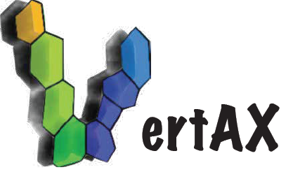

<div align="left">

<!-- Badges -->

[](https://creativecommons.org/licenses/by-sa/4.0/)
[](https://pypi.org/project/vertAX)
[](https://html-preview.github.io/?url=https://github.com/VirtualEmbryo/VertAX/blob/main/docs/vertax.html)

<!-- [](https://zenodo.org/badge/latestdoi/144513571) -->

</div>

<table border="0" cellspacing="0" cellpadding="0">
<tr>
<td width="40%" border="0">



</td>
<td width="60%" border="0">
<b>
A differentiable JAX-based framework<br>
for vertex modeling and inverse design of epithelial tissues.
</b>
<br><br>

[](https://gitlab.college-de-france.fr/virtualembryo/vertax) <br><b>— all in one unified Python package.</b>

</td>
</tr>
</table>

---

## What is VertAX?

Epithelial tissues dynamically reshape through local mechanical interactions among cells. Understanding, inferring, and designing these mechanics is a central challenge in developmental biology and biophysics. **VertAX** is a computational framework built to address this challenge.

**VertAX** is a **framework for vertex-based modeling**: it represents epithelial tissues as two-dimensional polygonal meshes in which cells are faces, junctions are edges, tricellular contacts are vertices, and mechanical equilibrium is defined by the minimum of a user-specified energy. Built on **JAX**, VertAX is designed not only for forward simulation, but also for inverse problems such as parameter inference and tissue design.

---

## Conceptual Overview

VertAX treats inverse modeling as a **bilevel optimization** problem:

$$
\begin{aligned}
\textbf{Outer problem (learning):} \quad
\theta^{\ast} &= \arg\min_{\theta} \mathcal{C}\left(X^{\ast}_{\theta},\theta\right)
&& \leftarrow \text{fit data or reach a target} \\
\textbf{Inner problem (physics):} \quad \text{s.t.}&
X^{\ast}_{\theta} \in \arg\min_{X} \mathcal{E}(X,\theta)
&& \leftarrow \text{compute mechanical equilibrium}
\end{aligned}
$$

Here, $X$ denotes the tissue configuration, i.e. the vertex positions of the mesh, and $\theta$ denotes the model parameters, such as line tensions, target areas, or shape factors.

In other words, VertAX repeatedly solves a mechanical equilibrium problem for a given parameter set $\theta$, then updates those parameters to better match data or a design objective.

<p align="center">
  <br>
  <em>Figure: Bilevel optimization loop in VertAX.</em>
</p>

---

## Core Features

- 🧩 **Bilevel optimization framework**  
  VertAX formulates inverse problems as nested optimization: an inner mechanical equilibrium problem and an outer parameter-learning problem.

- 🔬 **Multiple gradient strategies**  
  Supports **Automatic Differentiation (AD)**, **Implicit Differentiation (ID)**, and **Equilibrium Propagation (EP)**.

- 🔁 **Differentiable and non-differentiable workflows**  
  VertAX supports fully differentiable pipelines, while EP also enables inverse modeling with simulators that are only accessible through repeated executions.

- ⚡ **GPU acceleration with JAX**  
  JIT compilation and vectorization enable efficient simulations on CPU and GPU.

- 🎨 **Custom energies and costs in plain Python**  
  Define your own mechanical models and inverse-design objectives without changing the library internals.

- 🏗️ **Two simulation modes**  
  Supports both periodic tissues (bulk mechanics) and bounded tissues (finite clusters with curved interfaces).

- 🔀 **Automatic topology changes**  
  Handles T1 neighbor exchanges during optimization.

- 🔗 **Seamless ML integration**  
  Designed to work naturally with the JAX/Optax ecosystem.

---

## Installation

We recommend installing VertAX in a virtual environment:

```sh
python -m venv .venv
source .venv/bin/activate
```

### From source

```sh
git clone https://github.com/VirtualEmbryo/VertAX.git
cd vertax
pip install -e .
```

### From PyPI

```sh
pip install vertax
```

**Dependencies**: JAX, Optax, SciPy (for Voronoi initialization), Matplotlib (for plotting).

For GPU support, install JAX with CUDA as described in the [JAX docs](https://github.com/google/jax#installation) before installing VertAX.

---

## Simulation modes

VertAX supports two complementary simulation modes, designed for different classes of epithelial mechanics problems. The **periodic** mode is best suited for bulk tissue dynamics without explicit external boundaries, while the **bounded** mode is designed for finite tissue clusters with curved free interfaces. Both modes share the same vertex-based formulation and optimization framework, but differ in how boundaries are represented and initialized.

<table>
  <tr>
    <th>Mode</th>
    <th>Use case</th>
    <th>Initialization</th>
    <th>Illustration</th>
  </tr>
  <tr>
    <td><b>Periodic</b></td>
    <td>Bulk tissue dynamics, no explicit boundaries</td>
    <td>Random Voronoi seeds or segmented images (Cellpose)</td>
    <td rowspan="2" align="center">
      
    </td>
  </tr>
  <tr>
    <td><b>Bounded</b></td>
    <td>Finite tissue clusters with curved interfaces</td>
    <td>Random Voronoi seeds; boundary arcs as additional degrees of freedom (DOFs)</td>
  </tr>
</table>

---

## Gradient Strategies

VertAX implements and benchmarks three complementary methods for computing outer gradients through the implicit inner problem:

| Method                     | How it works                                                                                              | Pros                                                               | Cons                                                  |
| -------------------------- | --------------------------------------------------------------------------------------------------------- | ------------------------------------------------------------------ | ----------------------------------------------------- |
| **AD** (Automatic Diff.)   | Unrolls the inner optimization steps; forward-mode JVP via `jax.jacfwd`                                   | Exact for differentiable pipelines; easy in JAX                    | Cost scales with # iterations × # parameters          |
| **ID** (Implicit Diff.)    | Differentiates the optimality condition ∇ₓE=0 via Implicit Function Theorem; JVP or adjoint (VJP) variant | No unrolling; constant memory; exact near equilibrium              | Requires Hessian solve; sensitive to ill-conditioning |
| **EP** (Equilibrium Prop.) | Estimates gradient from perturbed free and nudged equilibria; no backprop required                        | Memory-efficient; works with non-differentiable/incomplete solvers | Approximate; depends on perturbation size β           |

**In practice**: AD and EP often recover similar parameter trends on synthetic inverse problems, while EP is especially attractive for simulators that cannot be made fully differentiable.

---

## Tutorials

See the [`examples/`](examples) folder for in-depth examples:

| Notebook                                  | Description                                                |
| ----------------------------------------- | ---------------------------------------------------------- |
| `inverse_modelling_example.ipynb`         | Inverse modeling with periodic boundary conditions         |
| `inverse_modelling_example_bounded.ipynb` | Inverse design with bounded cluster (convergent extension) |

---

## API Reference

See the [documentation](https://html-preview.github.io/?url=https://github.com/VirtualEmbryo/VertAX/blob/main/docs/vertax.html).

---

## Quick Start — Inverse Modeling

VertAX can also optimize model parameters to match a target geometry.

```python
import math
import jax
import jax.numpy as jnp
import optax

from vertax import PbcBilevelOptimizer, PbcMesh, BilevelOptimizationMethod, plot_mesh
from vertax.cost import cost_v2v
from vertax.energy import energy_shape_factor_hetero

# --- Mesh setup ---
n_cells = 20
width = height = math.sqrt(n_cells)

# New mesh with Periodic Boundary Conditions and 20 cells.
mesh = PbcMesh.from_random_seeds(
    nb_seeds=n_cells, width=width, height=height, random_key=0
)

# --- Attach parameters ---
mesh.vertices_params = jnp.zeros(mesh.nb_vertices)
mesh.edges_params    = jnp.zeros(mesh.nb_half_edges)   # not used here
mesh.faces_params    = jnp.full(mesh.nb_faces, 3.7)    # initial target shape factors

selected_faces = jnp.arange(mesh.nb_faces)

# --- Built-in energy function ---
def energy(vertTable, heTable, faceTable, _vert_params, _he_params, face_params):
    return energy_shape_factor_hetero(
        vertTable, heTable, faceTable,
        width, height,
        selected_faces,
        face_params,
    )

# --- Optimizer setup ---
optimizer = PbcBilevelOptimizer()
optimizer.loss_function_inner = energy
optimizer.inner_solver = optax.sgd(learning_rate=0.01)
optimizer.update_T1 = True
optimizer.min_dist_T1 = 0.005

# --- Relax the initial mesh ---
optimizer.inner_optimization(mesh)

# --- Create a target mesh with different face parameters ---
target = PbcMesh.copy_mesh(mesh)

key = jax.random.PRNGKey(1)
target.faces_params = 3.7 + 0.2 * jax.random.normal(key, shape=(target.nb_faces,))
target.vertices_params = jnp.zeros(target.nb_vertices)
target.edges_params    = jnp.zeros(target.nb_half_edges)

optimizer.inner_optimization(target)

# --- Register the target ---
optimizer.vertices_target = target.vertices.copy()
optimizer.edges_target    = target.edges.copy()
optimizer.faces_target    = target.faces.copy()

# --- Outer loss and bilevel method ---
optimizer.loss_function_outer = cost_v2v
optimizer.outer_solver = optax.adam(learning_rate=1e-4, nesterov=True)
optimizer.bilevel_optimization_method = BilevelOptimizationMethod.EQUILIBRIUM_PROPAGATION

# --- Run bilevel optimization ---
for epoch in range(20):
    optimizer.bilevel_optimization(mesh)

plot_mesh(mesh, title="Recovered mesh after inverse modeling")
```

For full inverse-modeling examples, see [Tutorials](#tutorials) section.

---

## Citing VertAX

If you use _VertAX_ in your research, please cite:

```

@misc{pasqui2026vertaxdifferentiablevertexmodel,
            title={VertAX: a differentiable vertex model for learning epithelial tissue mechanics},
            author={Alessandro Pasqui and Jim Martin Catacora Ocana and Anshuman Sinha and Matthieu Perez and Fabrice Delbary and Giorgio Gosti and Mattia Miotto and Domenico Caudo and Maxence Ernoult and Hervé Turlier},
            year={2026},
            eprint={2604.06896},
            archivePrefix={arXiv},
            primaryClass={cs.LG},
            url={<https://arxiv.org/abs/2604.06896}>,
}
```

<!-- > Pasqui A., Catacora Ocana J.M., Sinha A., Perez M., Delbary F., Gosti G., Miotto M., Caudo D., Ruocco G., Ernoult M.\*, Turlier H.\* (2025). _VertAX: A Differentiable Vertex Model for Learning Epithelial Tissue Mechanics._ -->

<!-- If a DOI or preprint becomes available, we also recommend citing that version. -->

---

## Funding

This project received funding from the European Union’s Horizon 2020 research and innovation programme under the **European Research Council** (ERC) grant agreement no. **949267**, and under the **Marie Skłodowska-Curie** grant agreement no. **945304** — Cofund **AI4theSciences**, hosted by **PSL University**. AP, JMCO, AS, FB, MP, FD and HT acknowledge support from CNRS and Collège de France

---

## License

VertAX is distributed under the **Creative Commons Attribution–ShareAlike 4.0 International (CC BY-SA 4.0)** [`license`](LICENSE).

You are free to share and adapt the material, provided that appropriate credit is given and that any derivative work is distributed under the same license.
